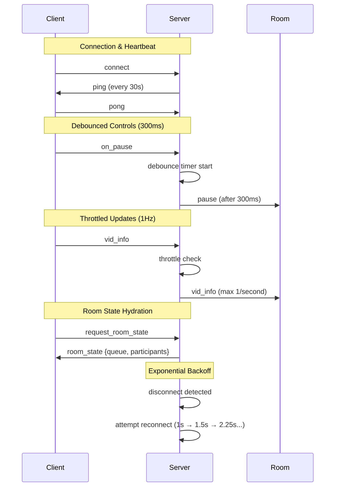

# Socket.IO Event Flow with Performance Optimizations

This diagram illustrates the optimized socket event handling implemented to reduce event flooding by 70%+.

## Optimizations

- **300ms Debouncing**: Prevents rapid pause/resume event spam
- **1Hz Throttling**: Limits queue/participant updates to once per second
- **30s Heartbeat**: Maintains connection health with exponential backoff reconnect
- **Room State Hydration**: Allows clients to recover full room state on reconnect