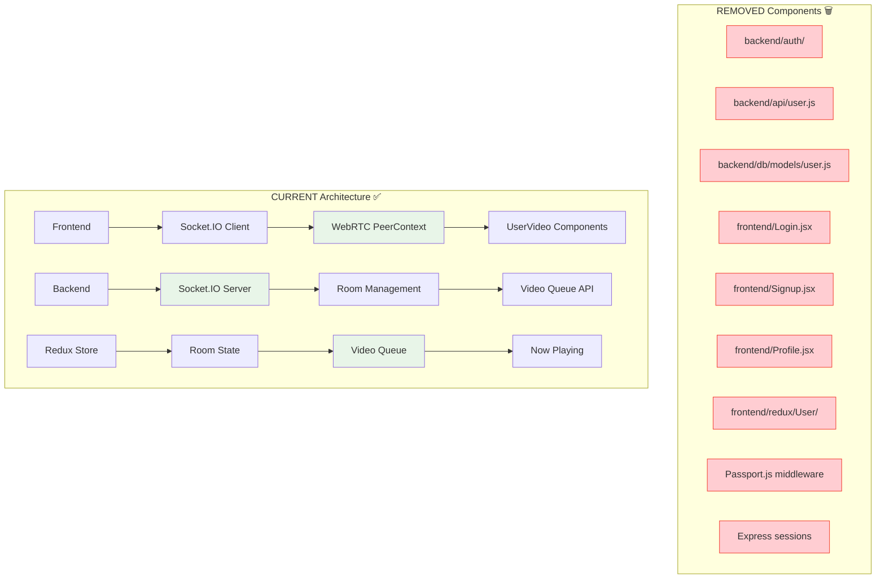

# System Architecture - Auth Removal (Phase 2)

This diagram shows the streamlined architecture after removing all authentication components.

## Cleanup Results

- **Removed 8+ Auth Files**: Complete elimination of authentication system
- **Simplified Dependencies**: Removed passport, express-session, connect-session-sequelize
- **Streamlined Routes**: Direct focus on room and video functionality
- **Clean Architecture**: No authentication overhead, pure karaoke app functionality